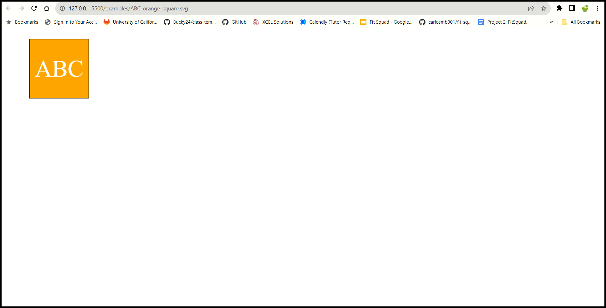

# Challenge 10

## Description
When you create a project, you might want to have a simple logo to go along with it to make your project unique. This application prompts the user for the logo text, text color, shape, and shape color that they would like to use for their logo. It then uses that information to create a Scalable Vector Graphics (SVG) image that reflects the user's choices. This project taught me how to write tests for functions contained in classes, render an SVG file, and use inheritance to transfer properties from a parent class to its child classes.

## Table of Contents
- [Description](#description)
- [Installation](#installation)
- [Usage](#usage)
- [Credits](#credits)
- [Contributing](#contributing)
- [Tests](#tests)
- [License](#license)
- [Questions](#questions)

## Installation
Once you clone the repository onto your own computer, open the `package.json` file in the Integrated Terminal, as shown below:

and then type and enter the command `npm install`:

and the following packages will be installed:

`inquirer @8.2.4`
`jest @29.7.0`

## Usage
Once you have opened the root directory in the Integrated Terminal, you can run tests to see if the shape classes' `render()` functions are working properly, and you can also submit answers to create a new svg file. To run the tests, type

`npm test`

in the terminal, and the functions in `lib/shapes.test.js` will be executed:

To create a new svg file, type

`node index.js`

in the terminal. You will be asked to enter the logo text (up to three characters), text color, shape, and shape color that you would like your svg logo to have:

Once you have answered all four questions, the new file will appear in the examples folder. The format for the file names is:

`[logo text]_[shape color]_[shape].svg`

The files are written this way to avoid overwriting previous files as new ones are created. Once the new file has been generated, you can right click on it and select `Open with Live Server`:

which will open it in the browser:

You can also create svg files with uppercase letters:

numbers:

and special characters:

A walkthrough video that demonstrates the application can be found [here](https://youtu.be/GhaqBli3blc).

## Credits
Received assistance from instructor Robbert Wijtman in the *#02-ask-the-class* Slack channel.

The following web resources helped me write the code for this project:

1. [My Challenge 9 submission](https://github.com/GimmeKitties711/challenge_9-user_informed_readme_generator)
2. [Why spaces could be problematic for file handling systems](https://superuser.com/questions/29111/what-technical-reasons-exist-for-not-using-space-characters-in-file-names)
3. [How to use regex](https://developer.mozilla.org/en-US/docs/Web/JavaScript/Guide/Regular_expressions)
4. [Special characters and their associated unicode](https://owasp.org/www-community/password-special-characters)
5. [Stack Overflow: How to get a tab character's unicode](https://stackoverflow.com/questions/9660987/how-to-get-a-tab-character)
6. [The replace() method](https://www.w3schools.com/jsref/jsref_replace.asp)
7. [How to add a border to svg shapes](https://www.w3schools.com/graphics/svg_polygon.asp)
8. [How to use toContain()](https://jestjs.io/docs/expect#tocontainitem)

## Contributing
No contribution is necessary for this project.

## Tests
Run `npm test` from the root directory to activate the tests written in `lib/shapes.test.js`:

If the tests pass, the terminal should show the following messages:

## License
No license is attached to this repository.

## Questions
If you have any questions for me, you can [follow me on GitHub](https://github.com/GimmeKitties711) or email me at eric20wang.wang@gmail.com.
